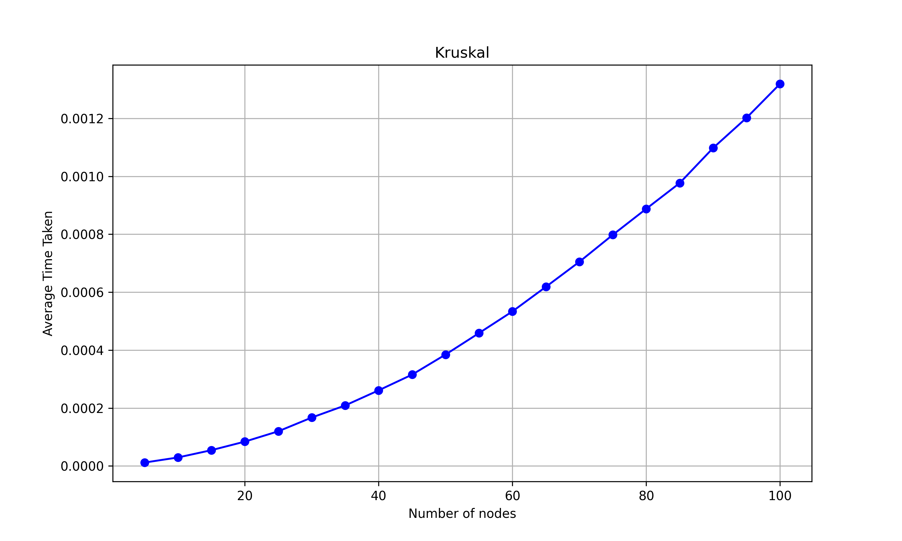

# DAALab

A collection of Design and Analysis of Algorithms Laboratory Programs (ISL46, RITB ISE 2022).

## Program 1: Linear Search and Binary Search
Given an array of elements ‘n’, search for an element in this array. Indicate the number of comparisons for varying values of n. The element to be searched can be the first element, last element, or an element other than the first and last. Assume the number of elements ‘n’, derive a formula to indicate the number of comparisons done.  
Use the following search techniques:
1. **Linear Search**
2. **Binary Search**

## Program 2: Array Operations
Write programs for each of the following and indicate the time complexity for varying values of n. Indicate the parameter ‘n’ and the basic operations:
- **a.** To find the sum of all the elements of the array. (Plot the graph)
- **b.** To find the binary equivalent of a given decimal number.
- **c.** Read a matrix and print those elements of the matrix that are even.

.png)

## Program 3: Sorting Goods Packages
The goods packages in a supermarket are assigned an integer label. Write programs to sort the set of goods packages based on label identifier using **Bubble Sort** and **Selection Sort** and determine the time required to sort. Plot a graph to compare the time complexity.

## Program 4: Merge Sort on Books
A library maintains details of N books where every book is assigned a unique ISBN. Develop a program to sort the books based on ISBN using the **Merge Sort** technique. Determine the time required to sort. Repeat the experiment for different values of N and plot a graph of the time taken versus N. Find its time complexity.

## Program 5: Quick Sort on Files
Consider a list of ‘n’ files numbered using IDs. Write a program to sort files based on their ID using **Quick Sort**. Determine the time required to sort the files. Plot a graph of the number of IDs versus time taken. Find its time complexity.

## Program 6: Horspool's String Matching Algorithm
Consider the problem of searching for a pattern in a given string. Design a program to locate the pattern using **Horspool’s Algorithm**. Give the trace of this algorithm. Find its time complexity.

## Program 7: Graph Algorithms
Consider a network of ‘n’ cities which is represented as a Graph. 
- **a.** Write a program to find the transitive closure of such a network using **Warshall’s Algorithm**.
- **b.** Write a program to find the shortest paths between all cities using **Floyd’s Algorithm**.  
Give the trace of both algorithms. Find their time complexity.

## Program 8: Knapsack Problem
Given ‘N’ items with their weight and value. Also, a bag is given whose capacity is ‘W’. Write a C program based on the **Dynamic Programming** design technique to find the subset of items that fit into the bag and earn maximum profit. Give the trace of this algorithm. Find its time complexity.

## Program 9: Kruskal’s Algorithm
Consider an electrical layout where ‘n’ houses are connected by electrical wires. Design a program using **Kruskal’s Algorithm** to output a connection with minimum cost. Trace the algorithm. Find its time complexity.

## Program 10: Dijkstra’s Algorithm
Given a weighted connected graph of N cities, write a program to find the shortest paths from a given city to all other cities using **Dijkstra's Algorithm**. Give the trace of this algorithm. Find its time complexity.

## Program 11: Breadth-First Search
Write a program to print all the nodes reachable from a given starting node in a digraph using the **BFS (Breadth-First Search)** method. Give the trace of this algorithm.

## Program 12: Heap Sort on Resumes
A university is looking for engineering graduates and needs to sort the candidates' resumes based on their ranking. Write a C program to sort the resumes using **Heap Sort**. Determine the time required to sort the elements. Plot a graph of the number of elements versus time taken. Specify the time efficiency class of this algorithm.

